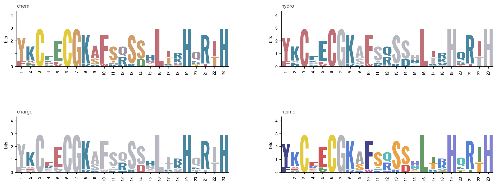

# seqlogo.py — getting started

`seqlogo.py` draws WebLogo-style protein sequence logos in any typeface: fonts installed on your Mac (including every face inside `.ttc` collections and any weight of a variable font), a font file on disk, or a Google Font.


## Requirements

Python 3.10+ with `numpy` and `matplotlib` (which brings in `fontTools`). `certifi` is used for Google Fonts downloads if present, and `PyYAML` for saved color sets.

## Quick start

```bash
# one logo with the default font (Oswald 700) and colors (chem);
# writes zinc_finger-oswald700-chem.png, named <alignment>-<font>-<colors>
./seqlogo.py examples/zinc_finger.fasta

# pick a font; -o sets the name and format (pdf, svg, png, eps)
./seqlogo.py aln.fasta -f "Futura:bold" -o logo.pdf

# compare typefaces on one sheet: Repeat the -f field:
./seqlogo.py aln.fasta -o compare.pdf \
    -f "Helvetica Neue:bold" -f "Georgia:bold" -f "google:Roboto Condensed:700"

# find fonts and their weights: installed, or on Google Fonts
./seqlogo.py --list-fonts courier
./seqlogo.py --list-fonts "Google:sofia sans"
```

Input can be FASTA, Clustal, or plain text with one aligned sequence per line (`-` reads from stdin).

## Web version

`web/` is a browser version with a fixed set of seven typefaces, the built-in color sets, and PNG, SVG or PDF downloads. It runs `seqlogo.py` in the page with [Pyodide](https://pyodide.org), so alignments never leave the visitor's computer and no server is needed; GitHub Pages can host it. To try it locally, run `python3 -m http.server 8000 --bind 127.0.0.1` in the repo folder and open <http://127.0.0.1:8000/web/>. The bundled fonts are from Google Fonts under their own licenses (`web/fonts/*.LICENSE.txt`); `web/make_wordmarks.py` redraws the page's wordmarks.

## Font specs

| Spec | Meaning |
|---|---|
| `"Family"` | installed family, bold (700) |
| `"Family:600"` / `"Family:heavy"` | a weight, 100–900 or a name (light, medium, semibold, bold, extrabold, heavy/black); nearest available is used |
| `"Family:bold:italic"` | italic face |
| `path/to/font.otf` | any `.ttf`, `.otf`, or `.ttc` file |
| `"google:Family:weight"` | downloads from Google Fonts once and caches it; nearest available weight is used |

## What the logo shows

As in WebLogo, each stack's height is the column's information content in bits, log2(20) − (H + e(n)), where H is the Shannon entropy of the residue frequencies and e(n) is the Schneider et al. (1986) small-sample correction. Letters are sized by frequency and stacked with the most common on top, and gaps are left out of the counts. WebLogo 3 may estimate the correction differently, so heights can differ slightly.

With `-U prob`, every stack is full height and letters show residue frequencies instead of bits:

```bash
./seqlogo.py examples/zinc_finger.fasta -U prob -f "google:Roboto Condensed:400"
```


## Useful options

Run `./seqlogo.py --help` for the full list.

| Option | Effect |
|---|---|
| `-c NAME` | color set: built-in or saved (see below); default `chem` |
| `-U probability` (or `-U prob`) | letter heights as frequencies instead of bits |
| `--no-correction` | turn off the small-sample correction |
| `--scale-by-occupancy` | shrink stacks in gappy columns |
| `--start N --end M` | show part of the alignment |
| `--background black` | black background with white axes and text; black letters are drawn white |
| `--gap 0.006` | space between stacked letters, as a fraction of the y-axis; `0` for none |
| `--per-line 40` | stacks per row |
| `--tick-every 5` | spacing of the position labels |
| `--show-font`, `--title` | labels |

## Notes

- Letters are drawn as vector outlines, so PDF and SVG output never need the font installed.
- Each letter is stretched to fill its box, so fonts differ mainly in letter shape rather than weight or width. The exception is a plain-bar (sans-serif) I, which fills only a third of the column so it doesn't become a solid block.
- The typeface "Delirium NCV" available online works well when stretched. Google:Sofia Sans Condensed works well at size 200 and 800.
- Offline without `-f`, if Oswald isn't cached, the default falls back to Helvetica, Liberation Sans, or DejaVu Sans (Bold).
- The first run indexes installed fonts (about 10 s); the index and downloads are cached in `~/.cache/seqlogo/`. `examples/make_examples.sh` generates the full set of example logos in `examples/png/` and `examples/pdf/`.

<div style="break-before: page"></div>

## Color sets

There are six built-in color sets: `chem` (the default), `hydro`, and `charge` color residues by chemistry, hydrophobicity, and charge in a muted palette; `rasmol` uses RasMol's finer amino-acid groups; `okabe_ito` uses the chemistry groups in a colour-blind-safe palette; and `mono` draws everything in black. Save your own in `seqlogo_styles.yaml` next to the script, one entry per set:

```yaml
okabe_ito:
  GSTYC: "#009E73"    # polar
  NQ: "#CC79A7"       # neutral
  KRH: "#0072B2"      # basic
  DE: "#D55E00"       # acidic
  PAWFLIMV: black     # hydrophobic
```

Each key under a set is a group of one-letter residue codes (one letter is fine), and each value is a color name or a hex code. Quote hex codes, because an unquoted `#` starts a comment. Residues a set doesn't list are drawn in black, and a saved set with a built-in's name replaces it.

```bash
./seqlogo.py aln.fasta -o logo.png -c okabe_ito   # use a set
./seqlogo.py --list-styles                        # list sets
./seqlogo.py --swatches swatches.png              # compare every set
./seqlogo.py aln.fasta -c mine -s other.yaml      # sets from another file

# contact sheet: repeat -c (and/or -f); --columns lays panels out in a grid
./seqlogo.py aln.fasta -o sheet.png --columns 2 \
    -c chem -c hydro -c charge -c rasmol
```




## Credits

`seqlogo.py` is an independent reimplementation for exploring typefaces and colors; it contains no WebLogo code. The ideas it implements belong to others:

- **Sequence logos** and the information-content method: Schneider, T. D. & Stephens, R. M. (1990). Sequence logos: a new way to display consensus sequences. *Nucleic Acids Research* 18, 6097–6100.
- **Small-sample correction**: Schneider, T. D., Stormo, G. D., Gold, L. & Ehrenfeucht, A. (1986). Information content of binding sites on nucleotide sequences. *Journal of Molecular Biology* 188, 415–431.
- **WebLogo**, whose output and defaults this tool follows: Crooks, G. E., Hon, G., Chandonia, J.-M. & Brenner, S. E. (2004). WebLogo: a sequence logo generator. *Genome Research* 14, 1188–1190. Source: <https://github.com/gecrooks/weblogo>.
- **Residue groups** of the built-in `hydro`, `charge`, and `chem` sets follow WebLogo 3's hydrophobicity, charge, and chemistry schemes (`chem` adds a separate sulfur group for C and M) in `weblogo/colorscheme.py`, Copyright © 2003–2005 The Regents of the University of California and © 2005 Gavin E. Crooks, distributed under the MIT License (notice in `LICENSE-weblogo.txt`). The colors are new.
- **RasMol** residue groups (`rasmol` set): Sayle, R. A. & Milner-White, E. J. (1995). RASMOL: biomolecular graphics for all. *Trends in Biochemical Sciences* 20, 374. The colors are new.
- **Okabe–Ito palette** (`okabe_ito` example set): Okabe, M. & Ito, K. (2008). *Color Universal Design (CUD): how to make figures and presentations that are friendly to colorblind people.*

Created using Claude Code - Opus 5.5.
